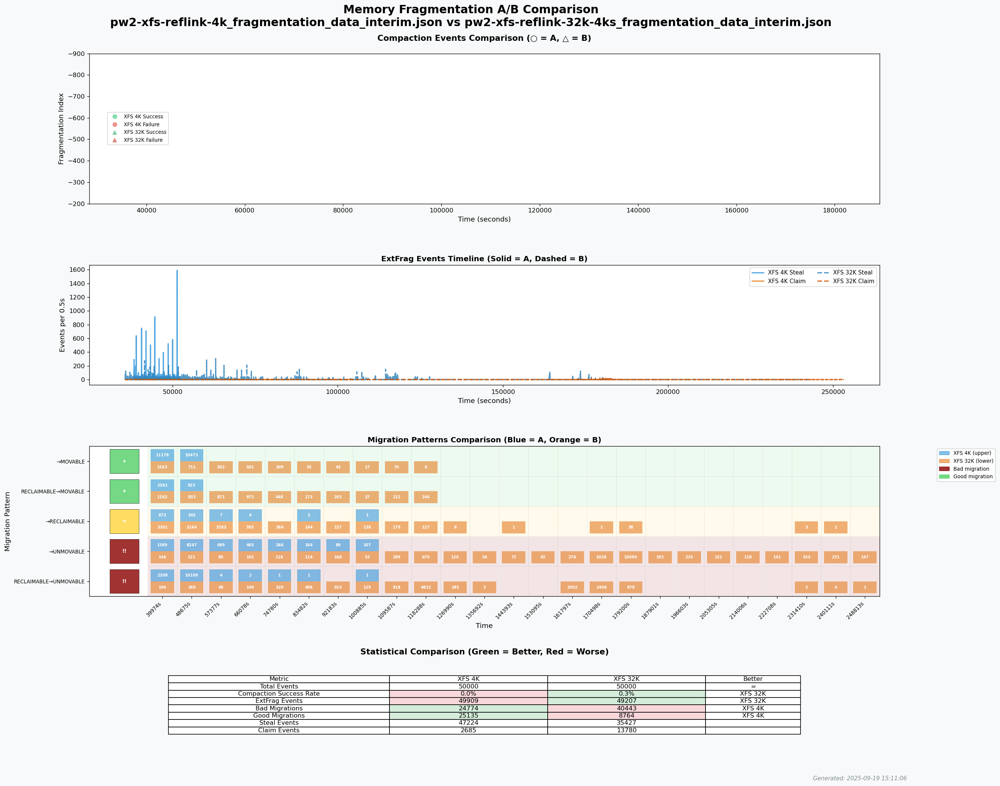
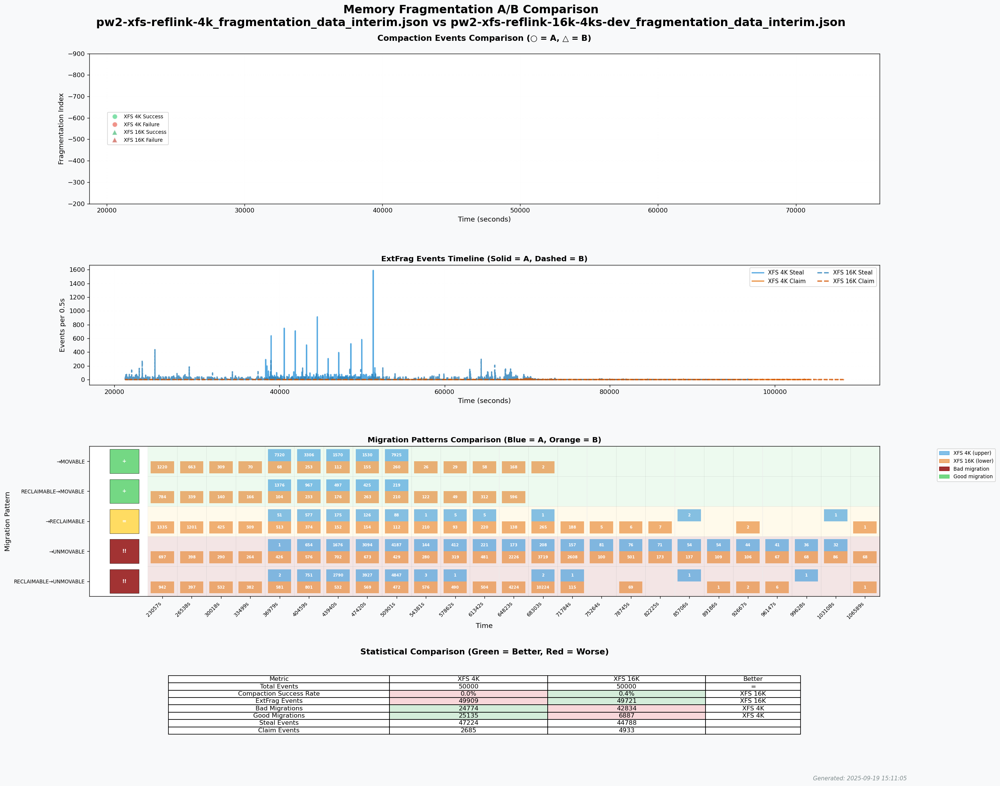
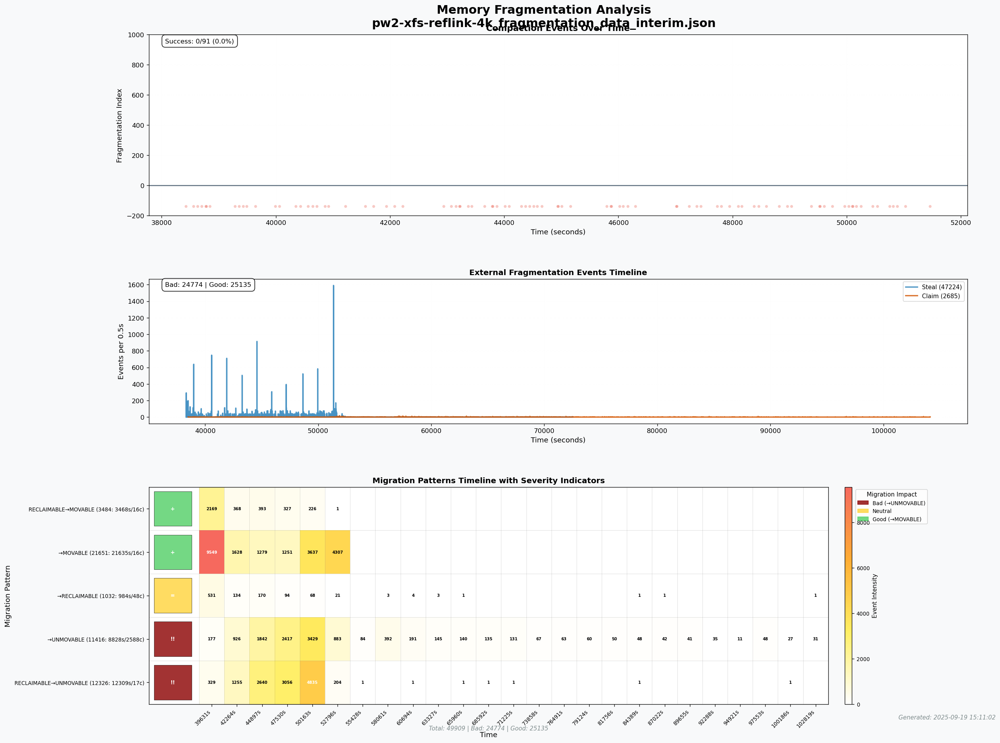
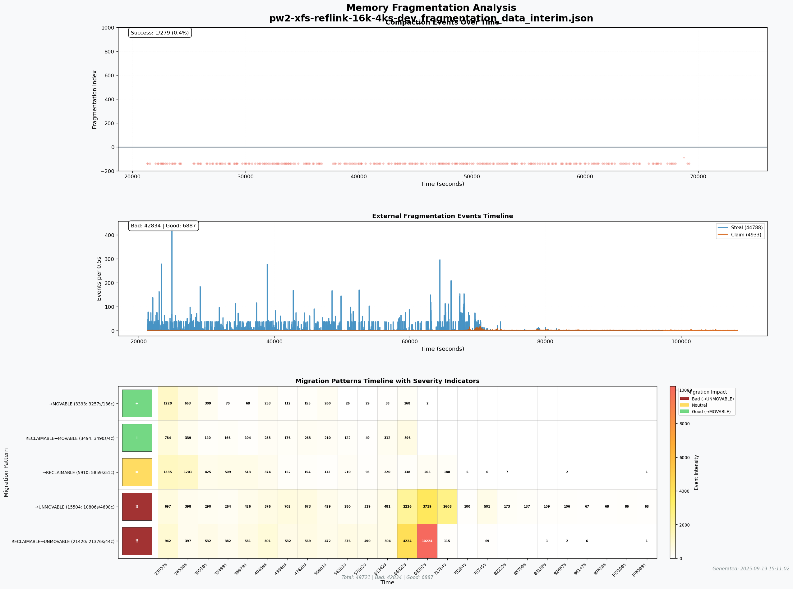

# 📊 Plot Memory Fragmentation


---

At LSFMM 2024 we reviewed [automating measuring memory fragmentation](https://www.youtube.com/watch?v=DL1FDK5-UVM)
and essentially we had 0 consensus on how to visualize memory fragmentation.

> **This project** aims at trying to expand on that with tracepoints, eBPF scripts, and matplotlib visualizations to help us get closer to something sensible.

## 🎯 Key Insights from Parallel Writeback Analysis

Our analysis reveals fragmentation patterns across different XFS block sizes under parallel writeback workloads:



The visualizations demonstrate how external fragmentation events, migration patterns, and compaction success rates vary between configurations, providing critical insights for filesystem performance optimization.

We primarily aim at evaluating as a case study, does
[Large Block Size support on the Linux kernel](https://kernelnewbies.org/KernelProjects/large-block-size)
create worse memory fragmentation situation for users? Uses of this
visualization effort can be used for other analysis. The ultimate goal is
to include this as part of
[kdevops](https://github.com/linux-kdevops/kdevops)
for monitoring and analyzing any workflow.

## 👥 Contributors

This effort is brought to you by:

- **Swarna Prabhu**
- **David Bueso**
- **Luis Chamberlain**

## 🔧 Kernel Requirements

You can use the
[20250903-compaction-tracepoints](https://git.kernel.org/pub/scm/linux/kernel/git/mcgrof/linux.git/log/?h=20250903-compaction-tracepoints)
branch with two patches which are important in current analysis:

1. **[mm: add simple folio migration debugfs stats](https://git.kernel.org/pub/scm/linux/kernel/git/mcgrof/linux.git/commit/?h=20250903-compaction-tracepoints&id=2a364ff51155ecd1fdb3f5dd357df6126d84eaa8)**  
   Provides a way to evaluate folio migrations over time.
   
2. **[mm: add compaction success/failure tracepoints and fragmentation tracking](https://git.kernel.org/pub/scm/linux/kernel/git/mcgrof/linux.git/commit/?h=20250903-compaction-tracepoints&id=1f04c38a08decc2e10035aa27a5f9eafe94c7f2e)**  
   Provides a tracepoint at compaction success/failures with enough semantics for us to evaluate at what order compaction succeeded or failed and at what fragmentation index.

## 📦 Userspace Requirements

```bash
apt-get install python3-bpfcc
```

## 🔍 fragmentation_tracker.py

The `fragmentation_tracker.py` is an eBPF script which tracks all tracepoints with order, fragmentation index and page mobility. Since the compaction tracepoints are out of tree, they are optional. The script will ignore those tracepoints if your kernel lacks them.

## 🚀 Quick Start

Just run:

```bash
make
```

This will:
1. Automatically extract data from `pw-data-v1.tar.gz` (if needed)
2. Generate all visualizations using **all available CPU cores** in parallel
3. Copy results to the `images/` directory

For specific analyses:

```bash
make pw-analysis  # Run only parallel writeback analysis (also parallel)
make simple       # Run only simple demo analysis
make compare      # Run only A/B comparison demo
```

**Note**: All targets now run in parallel by default using all CPU cores for maximum speed. The data is automatically extracted from the compressed archive on first run to stay within GitHub's file size limits.

**Performance Note**: The pw-data-v1 files contain ~500K events each, which may take significant time to process (10-30 minutes per file depending on CPU). Pre-generated visualizations are included in the `images/` directory. To regenerate them, ensure you have sufficient time and computational resources.

## 📈 Visualization Output


## 🚦 Parallel Writeback Analysis

The parallel writeback evaluation tests memory fragmentation patterns across different XFS configurations with varying block sizes. This analysis helps determine whether larger block sizes lead to worse fragmentation under parallel writeback workloads.

### Sample Visualizations

#### XFS 4K vs 16K Block Size Comparison


#### XFS 4K vs 32K Block Size Comparison


#### XFS 16K vs 32K Block Size Comparison


### Individual Configuration Analysis

#### XFS 4K Baseline


#### XFS 16K Development Kernel


#### XFS 32K Stable Kernel


### Available Configurations

The `pw-data-v1/` directory contains fragmentation data from the following XFS configurations:

- **XFS 4K**: Baseline 4KB block size configuration
- **XFS 8K-dev**: 8KB blocks on development kernel
- **XFS 16K-dev**: 16KB blocks on development kernel
- **XFS 32K**: 32KB blocks on stable kernel
- **XFS 32K-dev**: 32KB blocks on development kernel

### Visualization Types

Running `make pw-analysis` generates:

1. **Individual Configuration Analysis** (`output/*_single.png`)
   - Compaction events timeline
   - External fragmentation (extfrag) event distribution
   - Migration pattern heatmap with severity indicators
   - Per-configuration statistics summary

2. **A/B Comparisons** (`output/pw2-*.png`)
   - 4K vs 16K block size comparison
   - 4K vs 32K block size comparison
   - 16K vs 32K block size comparison
   - Development kernel comparisons
   - Statistical comparison tables

### Key Metrics Analyzed

- **External Fragmentation Events**: Page steals vs claims from different migrate types
- **Migration Patterns**: Tracking migrations between MOVABLE, UNMOVABLE, and RECLAIMABLE zones
- **Compaction Success Rate**: Percentage of successful vs failed compaction attempts
- **Fragmentation Severity**: Color-coded indicators showing impact of different migration patterns

### Interpreting Results

The visualizations use the following color coding:

- 🔴 **Red**: Bad migrations (e.g., MOVABLE → UNMOVABLE)
- 🟢 **Green**: Good migrations (e.g., UNMOVABLE → MOVABLE)
- 🟡 **Yellow**: Neutral migrations
- 🔵 **Blue/Orange**: Dataset A vs B in comparison mode

Migration severity indicators:
- `!!` : Very bad migration pattern (severity ≤ -2)
- `!`  : Bad migration pattern (severity ≤ -1)
- `+`  : Good migration pattern (severity ≥ 1)
- `=`  : Neutral migration pattern

### Generated Outputs

All visualization outputs are saved to the `output/` directory:

```bash
output/
├── pw2-xfs-reflink-4k_single.png           # Individual 4K analysis
├── pw2-xfs-reflink-16k-4ks-dev_single.png  # Individual 16K analysis
├── pw2-xfs-reflink-32k-4ks_single.png      # Individual 32K analysis
├── pw2-xfs-reflink-4k-vs-16k.png          # 4K vs 16K comparison
├── pw2-xfs-reflink-4k-vs-32k.png          # 4K vs 32K comparison
├── pw2-xfs-reflink-16k-vs-32k.png         # 16K vs 32K comparison
└── pw2-all-configs-comparison.png          # All configurations overview
```

## 🔬 Compaction Tracepoints

Two extra tracepoints are added so we can get enough context for at what order
and at what fragmentation index did compaction succeed or fail over time. These
are not upstream, and so the

## 📌 mm_page_alloc_extfrag Tracepoint

> 📖 Refer to the [kernel external fragmentation documentation](https://www.kernel.org/doc/html/latest/trace/events-kmem.html#external-fragmentation).

### Why this tracepoint matters

Tracking `/proc/pagetypeinfo` can be insufficient as it is ultimately limited by not having information on mixed pageblocks. The real trouble for fragmentation begins when there are no pages of the required migrate type to satisfy an allocation. The missing pages are taken/stolen from another migrate type instead, producing pageblock with mixed migrate types.

**This is where this tracepoint helps** - it provides the most insight on system fragmentation. This can occur if either the allocator fallback order is
smaller than a pageblock order (order-9 on x86-64) or through compaction
capturing, and it is considered an event that will cause external fragmentation
issues in the future. This can ultimately impede compaction from defragmenting
and creating opportunities for large pages/folio, just with a single unmovable
allocation in a movable pageblock. Among other factors, when falling back to
another migratetype during allocation, this allocation type will depend on how
stealing semantics work, as to whether or not a pageblock is polluted or
entirely claimed to satisfy new allocations. This is important because it goes
back to again the movable vs unmovable semantics. Since unmovable/reclaimable
allocations would cause permanent fragmentation if they fell back to allocating
from a movable block (polluting it), such cases will claim the whole block
regardless of the allocation size. Later movable allocations can steal from
this block, which is less problematic. The kernel heuristics tries as much as
possible to avoid fragmentation and mixing pageblocks by stealing the largest
possible pages such that the pageblock's migratetype can be simply changed and
avoid fragmentation altogether. Further, when a page is freed, it will return
to a free list with migrate type of its pageblock.

### Mitigation Strategies

Linux attempts to mitigate against these `mm_page_alloc_extfrag` events by temporarily boosting reclaim for the respective zone watermark when these events occur via the [`watermark_boost_factor`](https://docs.kernel.org/admin-guide/sysctl/vm.html#watermark-boost-factor) tunnable.

Once
[reclaim](https://git.kernel.org/pub/scm/linux/kernel/git/torvalds/linux.git/tree/mm/vmscan.c#n7104)
has finished, kcompacd is awoken to defragment the pageblocks. Note that this
boosted reclaim is simple such to avoid disrupting the system, so things like
writeback and swapping and are avoided by kswapd. If boosting has occurred, it
will be reflected in the boost field in
[/proc/zoneinfo](https://www.man7.org/linux/man-pages/man5/proc_zoneinfo.5.html).
Another important and most recent option is the
[defrag_mode](https://git.kernel.org/pub/scm/linux/kernel/git/torvalds/linux.git/tree/Documentation/admin-guide/sysctl/vm.rst#n149),
which pushes for reclaim/compaction to be done in full extent before incurring
in mixed pageblock fallback events. Another way to mitigate against such
occurrences is by the buddy allocator trying to get pages from a lower NUMA
local zone (`ZONE_DMA32` specifically) before fragmenting a higher zone (Normal).
This makes a very big difference. The reason it's only `ZONE_DMA32` and no other
lower zone type is a balance between avoiding premature low memory pressure and
size of the zone.
